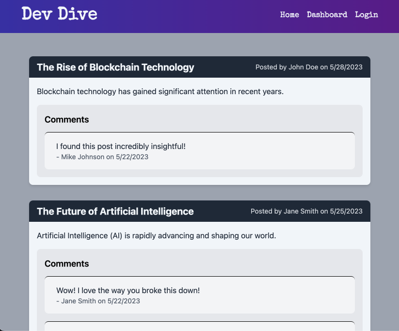

# DevDive

## Description

This project focuses on building a CMS-style blog site where developers can publish their blog posts and interact with other developers through comments. The site follows the MVC paradigm, utilizing Handlebars.js as the templating language, Sequelize as the ORM, and the express-session npm package for authentication. The application allows users to sign up, log in, create blog posts, comment on posts, and perform various other actions.

## Installation

To install and run the project locally, follow these steps:

1. Clone the GitHub repository
2. Install the necessary dependencies by running the command: `npm install`
3. Set up the database configuration by creating a `.env` file and adding the required environment variables.
4. Run the application using the command: `npm start`

## Technologies Used

The project utilizes the following technologies:

- Express.js
- Handlebars.js
- Sequelize ORM
- MySQL2
- dotenv
- bcrypt
- express-session
- connect-session-sequelize

## Deployment

The application is deployed on Heroku and can be accessed here [DevDive](https://devdive.herokuapp.com/)

## Screenshot

